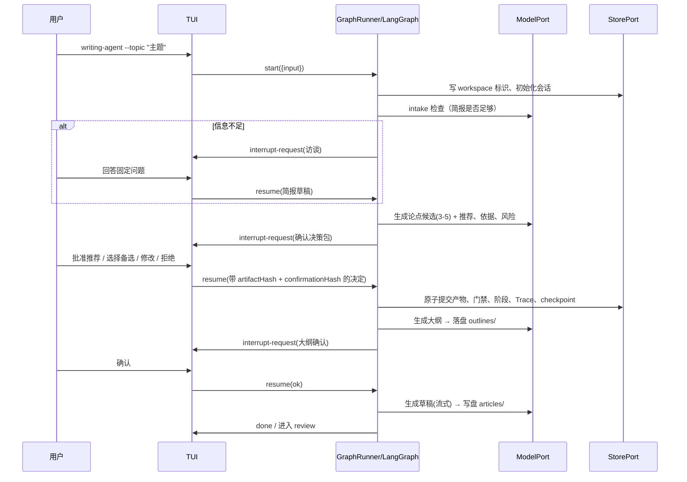
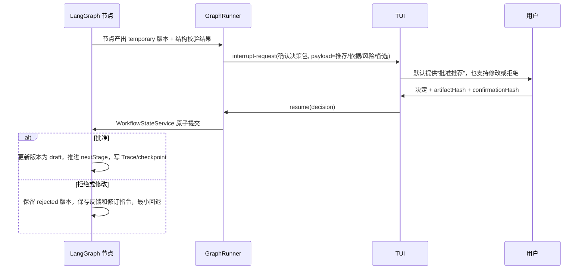
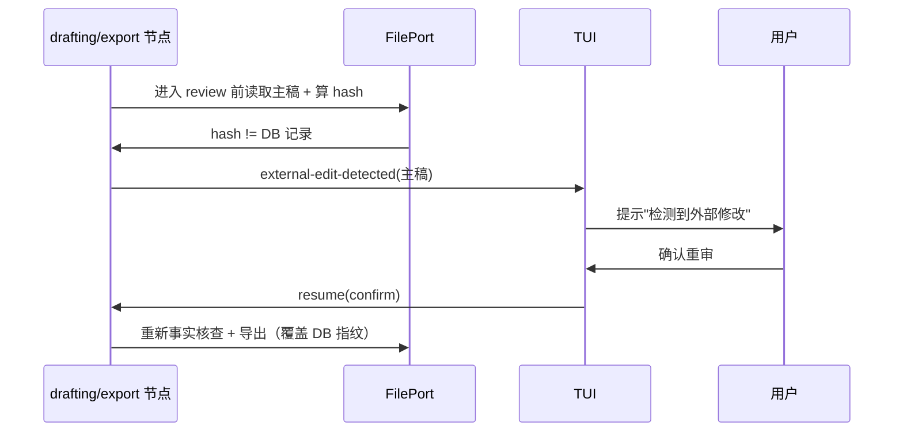
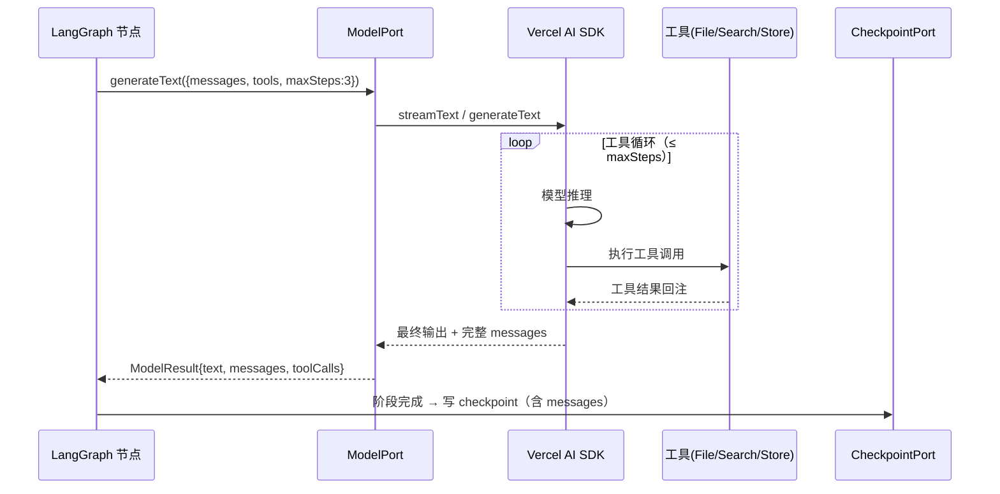

# 写作 Agent 技术设计方案

- 日期：2026-09-05（2026-09-07 增补：模型节点执行模型、上下文与记忆、LangGraph/AI SDK 协作机制、模块协作契约，见 §7.4、§15–17）
- 状态：评审中
- 关联需求：`docs/wiki/01-prd-writing-agent.md`
- 关联计划：`docs/plan/00-plan.md`
- 关联决策：`docs/adr/0001`–`0008`（协作机制细化见 ADR 0001 追加小节）

## 1. 目标与约束

### 1.1 目标

在已确认的 MVP 需求基线上，给出**可实现的**技术架构：模块划分、核心运行模型（图执行与 TUI 协调）、数据模型、时序、关键选型，以及扩展性 / 可观测性 / 可调试性 / 性能四维评估。

### 1.2 硬约束（来自已确认决策）

| 约束 | 出处 |
|---|---|
| TypeScript 单进程本地运行 | D1 |
| LangGraph.js 编排（StateGraph + interrupt/resume） | D2 / ADR 0001 |
| Vercel AI SDK 只在模型节点内负责模型调用与流式 | ADR 0001 |
| Ink 渲染 TUI | D3 / D4 |
| SQLite 全局单库（session.db + profile.db） | D5 / ADR 0006 |
| Markdown 主稿 + 确定性 HTML | D6 |
| Checkpoint 阶段原子；文件是内容权威 | ADR 0006 / ADR 0007 |
| 外部编辑检测（mtime/hash）、研究预算、门禁分类、最小回退、版本化确认提交 | ADR 0003–0009 |

### 1.3 明确不做

多进程、多租户、向量库、自动发布、其他平台、主题编辑器（均为 PRD 排除项）。

---

## 2. 总体架构

### 2.1 分层与依赖方向

```text
┌────────────────────────────────────────────────────────────────────┐
│  shell 层（可替换：TUI → 未来 GUI）                                    │
│  ┌──────────────┐   ┌────────────────────────────────────────────┐  │
│  │ cli/ 入口     │   │ tui (Ink)                                  │  │
│  │ 参数解析      │   │ 欢迎页 · 确认卡 · 进度 · 会话列表 · Trace  │  │
│  │ 命令分发      │   │ 外部编辑提示 · /note · /idea               │  │
│  │ 退出处理      │   │（只读状态 + 提交用户决定，不持有业务状态）   │  │
│  └──────┬───────┘   └───────────────┬────────────────────────────┘  │
└─────────┼───────────────────────────┼───────────────────────────────┘
          │ invoke / resume / abort   │ 订阅 AgentEvent 流
          ▼                           ▼
┌────────────────────────────────────────────────────────────────────┐
│  agent 层（LangGraph 图 + GraphRunner）                              │
│                                                                     │
│  StateGraph：intake → research → thesis → outline → drafting        │
│              → review → export                                      │
│  门禁 = interrupt() 暂停点 · resume 携带用户决定                     │
│  外部编辑检测 = 节点前的 mtime/hash 对比                             │
│  GraphRunner：封装 graph.stream 迭代生命周期（start/resume/abort）    │
└───────┬──────────────┬──────────────┬──────────────┬────────────────┘
        │              │              │              │
        ▼              ▼              ▼              ▼
┌────────────┐  ┌───────────┐  ┌───────────┐  ┌──────────────┐
│ adapters   │  │ adapters  │  │ adapters  │  │ adapters     │
│ model      │  │ search    │  │ file fs   │  │ sqlite       │
│ (AI SDK)   │  │ (Tavily)  │  │ 读写+指纹 │  │ store+cp     │
└─────┬──────┘  └─────┬─────┘  └─────┬─────┘  └──────┬───────┘
      │               │              │               │
      ▼               ▼              ▼               ▼
┌────────────────────────────────────────────────────────────────────┐
│  领域层 domain（无外部依赖，纯逻辑）                                   │
│  WritingSession · Stage · Gate · ArtifactVersion · TraceEvent       │
│  事实规则 · 版本/回退规则 · 目录模型 · 研究预算                       │
└────────────────────────────────────────────────────────────────────┘
```

**依赖规则**：领域层不依赖任何模块；`adapters` 实现领域层声明的端口（ports）；`agent` 组合 adapters 建图；`shell` 依赖 agent 与领域类型。业务状态**永不写入 shell**——shell 只读展示 + 提交决定。

### 2.2 端口（ports）清单

端口是领域层定义的能力接口，实现放在 adapters，是未来替换（GUI、新搜索、新模型）的接缝：

| 端口 | 定义能力 | MVP 实现 |
|---|---|---|
| `ModelPort` | 流式文本生成、结构化输出、工具调用 | Vercel AI SDK + 本地 OpenAI-compatible provider |
| `SearchPort` | `search(query) → SearchResult[]` | Tavily adapter（mock 可验收） |
| `StorePort` | 会话/版本/门禁/Trace/ideas/研究计划/内容诊断读写，以及原子确认提交 | better-sqlite3 单库 adapter |
| `CheckpointPort` | LangGraph checkpoint 读写 | `@langchain/langgraph-checkpoint-sqlite`（SqliteSaver） |
| `FilePort` | 素材/大纲/主稿读写、mtime+hash 指纹 | node:fs adapter |
| `EventPort` | 向 shell 发布 AgentEvent 流 | 内存事件总线（可换 IPC/WebSocket 供 GUI） |
| `ContentDiagnosisPort` | review 内部的内容诊断与确定性修改建议 | MVP 规则/模型组合实现；完整五维诊断仍为后续增强 |

### 2.3 模块归属（目录）

```text
src/
├── cli/             # 入口、参数（--topic/--file/--theme/--cwd/--fast/--output-dir）、退出
├── tui/             # Ink 组件：欢迎页、确认卡、进度、列表、Trace 查看器、/note /idea
├── agent/           # LangGraph 图、节点、GraphRunner、门禁 interrupt 封装
├── domain/          # 纯类型与规则：Stage、Gate、ArtifactVersion、事实规则、目录模型、研究预算
├── ports/           # 领域层声明的能力接口（见 2.2）
├── adapters/
│   ├── model/       # Vercel AI SDK provider 封装
│   ├── search/      # Tavily + mock
│   ├── store/       # better-sqlite3：session.db、profile.db
│   ├── checkpoint/  # SqliteSaver
│   └── file/        # fs 读写 + 指纹
├── observability/   # Trace 事件模型、EventPort 实现、指标聚合
└── config/          # 环境变量、config.json、主题配置
```

---

## 3. 核心运行模型：图执行与 TUI 的协调

这是整个架构的技术骨架。LangGraph 的 `interrupt()` 是**同步暂停**——图执行流被挂起，等待外部 `resume`；Ink 是**渲染循环**，两者不能直接阻塞对方。设计如下。

### 3.1 三层协作

```text
┌────────┐  ①start()   ┌────────────────┐  ②stream 迭代   ┌──────────┐
│  TUI   │ ───────────► │  GraphRunner   │ ──────────────► │LangGraph │
│ (Ink)  │              │  (agent 层)    │                 │  graph   │
└───┬────┘              └───────┬────────┘                 └──────────┘
    │     ⑨resume(payload)     │ ③interrupt / 事件
    └───────────────────────────┘        │
                                          ▼
                               ┌──────────────────────┐
                               │      EventPort       │
                               │ progress/tool/gate/  │
                               │ error/external-edit  │
                               └──────────────────────┘
```

- **GraphRunner** 是 agent 层的门面：持有 `thread_id`，封装 `graph.stream()` 的迭代生命周期，把 LangGraph 的原语（interrupt 抛出的特殊流）翻译成领域事件推给 EventPort。
- 首次 `start(input)`：`graph.stream(input, { configurable: { thread_id } })`，迭代直到遇到 interrupt 或结束。
- 暂停后 `resume(payload)`：`graph.stream(Command(resume = payload), 同一 thread_id)`，从 checkpoint 继续。
- 用户所有决定（确认/拒绝/修订指令/外部编辑三选/访谈回答）都通过 `resume(payload)` 注入。

### 3.2 AgentEvent 事件模型（Trace 与 UI 同源）

AgentEvent 是**图 → 外界的唯一通道**，同时满足两个消费方：TUI 展示、Trace 持久化。二者同源保证"回放 = 重放事件给 TUI"。

```ts
type AgentEvent =
  | { type: 'stage-change'; stage: Stage; mode: 'normal'|'fast' }
  | { type: 'progress'; stage: Stage; elapsedMs: number }
  | { type: 'model-token'; text: string }                    // 流式，供 TUI 渐显
  | { type: 'tool-call'; tool: ToolName; args: string }
  | { type: 'tool-result'; tool: ToolName; summary: string }
  | { type: 'material-pending'; items: MaterialRef[] }       // 采纳门禁候选
  | { type: 'interrupt-request'; gate: GateType; payload: unknown }
  | { type: 'external-edit-detected'; artifact: 'outline'|'draft'; options: EditChoice[] }
  | { type: 'fact-report'; report: FactCheckReport }
  | { type: 'research-budget-exhausted'; rounds: number }
  | { type: 'error'; code: ErrorCode; message: string; recoverable: boolean }
  | { type: 'done'; result: ExportResult };
```

**演进保证**：事件类型是领域层的联合类型；TUI 用 `switch` 穷尽处理。新增阶段/事件类型不改动 shell 的端口契约，只增分支。

### 3.3 为什么这样设计（对比备选）

| 方案 | 说明 | 结论 |
|---|---|---|
| **GraphRunner + EventPort（采用）** | 图执行与渲染解耦；事件即 Trace；GUI 只需换 EventPort 消费端 | MVP 首选 |
| 图执行塞进 TUI 组件生命周期 | Ink 组件卸载/重挂会导致执行态丢失，无法可靠支撑 interrupt/resume | 否决 |
| 子进程隔离 agent | 进程间通信复杂、checkpoint 共享需额外协议，单进程本地场景收益低 | 否决（GUI 阶段再评估） |

---

## 4. 数据模型与存储设计

### 4.1 存储布局（全局单库 + 工作目录文件）

```text
~/.writing-agent/
├── config.json
├── profile.db              # 作者档案
└── session.db              # 会话数据 + LangGraph checkpoint + Trace + ideas
    └── materials/<sessionId>/   # 素材快照

<工作目录>/
├── .writing-agent/workspace.json
├── outlines/<slug>.outline.md
└── articles/<slug>.md / .html
```

### 4.2 session.db 表设计

```sql
sessions(
  id TEXT PK, name TEXT, workspace TEXT, mode TEXT, stage TEXT,
  created_at INTEGER, updated_at INTEGER
)

checkpoints(          -- LangGraph SqliteSaver 自有表（列结构以该库为准），按 thread_id 关联
  thread_id TEXT, checkpoint_ns TEXT, checkpoint BLOB,
  metadata TEXT
)

trace(
  id INTEGER PK, session_id TEXT, seq INTEGER, ts INTEGER,
  type TEXT, payload TEXT              -- AgentEvent 的持久化形态
)

materials(
  id TEXT PK, session_id TEXT, kind TEXT, path TEXT,
  content_hash TEXT, status TEXT       -- pending / adopted / rejected
)

evidence(
  id TEXT PK, session_id TEXT, fact TEXT, source TEXT,
  source_kind TEXT, verify_status TEXT,   -- unverified / verified / dispute
  reason_code TEXT                        -- missing-source / unverifiable / conflict
)

artifact_versions(
  id TEXT PK, session_id TEXT, stage TEXT, artifact_id TEXT,
  status TEXT,                           -- draft / rejected / temporary
  file_path TEXT, content_hash TEXT, confirmed_at INTEGER
)

gates(
  id TEXT PK, session_id TEXT, gate_type TEXT, status TEXT,
  responded_at INTEGER, decision TEXT, revision_json TEXT
)

ideas(id TEXT PK, content TEXT, created_at INTEGER, used_at INTEGER)

notes(id TEXT PK, session_id TEXT, content TEXT, created_at INTEGER)

research_plans(
  id TEXT PK, session_id TEXT, question TEXT, sub_questions_json TEXT,
  selection_criteria_json TEXT, exclusion_criteria_json TEXT,
  round INTEGER, status TEXT, created_at INTEGER
)

research_candidates(
  id TEXT PK, plan_id TEXT, title TEXT, url TEXT, source_type TEXT,
  retrieved_at INTEGER, summary TEXT, decision TEXT,
  decision_reason TEXT, evidence_refs_json TEXT
)

content_diagnoses(
  id TEXT PK, session_id TEXT, artifact_version_id TEXT,
  dimension TEXT, location TEXT, problem TEXT, suggestion TEXT,
  applied INTEGER, applied_artifact_version_id TEXT
)
```

**指纹设计**：`artifact_versions.content_hash` 存文件内容 hash + 显式记录 mtime。外部编辑检测 = 读取文件 → 算 hash → 与 DB 对比；mtime 仅作快速路径，hash 为权威判定。

**确认提交设计（ADR 0009）**：确认不是单独修改一个门禁字段，而是针对一个具体产出版本提交一个确认决策包。决策包至少包含 `artifactId`、`artifactHash`、`confirmationHash`、Agent 推荐、推荐依据、主要风险和备选项。`WorkflowStateService` 在同一个 SQLite 事务内校验结构契约和指纹，并更新产物状态、门禁记录、会话阶段、Trace 与稳定 checkpoint；任一步失败全部回滚。

**阶段产物契约**：每个可流转阶段由 `StageArtifactContract` 定义必需字段、必需章节、可接受的上游版本和校验规则。模型只能生成候选或推荐，不能直接写入已确认状态或推进阶段。

### 4.3 checkpoint 阶段原子（ADR 0007）

- 节点执行中不写 checkpoint；仅在**阶段完成后**调用 checkpointer 落盘稳定状态；
- 阶段执行中 `Ctrl+C` / 崩溃：`thread_id` 存在但该阶段无 checkpoint → 恢复时重做整个阶段（不把半成品当成果，符合 PRD 4.4）；
- `interrupt()` 会隐式写 checkpoint（门禁点），因为必须保存"暂停到哪了"。

---

## 5. 关键时序

### 5.1 主流程：启动 → 首版草稿



### 5.2 门禁 interrupt / resume（普通模式 4 处 + 采纳门禁 + 外部编辑）



### 5.3 外部编辑与确认失效

外部编辑只是确认失效的一种情况。以下事件统一使当前确认失效：文件内容变化、Agent 生成新版本、用户修改标题或已选论点、确认卡内容变化、拒绝回退产生新上下文。所有门禁恢复前都重新验证 `artifactHash` 和 `confirmationHash`，失败时重新生成确认卡，不静默继续。



### 5.4 Ctrl+C 保存退出

```text
用户按 Ctrl+C → shell 捕获 SIGINT → 取消当前 graph.stream 迭代
→ 若处于节点执行中：不写 checkpoint（保持上次稳定点）
→ 若处于 interrupt 暂停点：已隐式保存
→ 回欢迎页 / 退出
```

---

## 6. 技术选型对比

> 选型原则：**本地优先、单进程、可替换、少依赖**。每项给出对比与结论，结论标注对应 ADR/计划出处。

### 6.1 运行时与语言

| 维度 | Node.js + TypeScript | Bun | Deno |
|---|---|---|---|
| 生态兼容 | ✅ 最大（LangGraph/AI SDK/Ink 全部优先支持） | ⚠️ 多数可用但个别原生模块不兼容 | ⚠️ npm 兼容性一般 |
| LangGraph 支持 | ✅ 一等公民 | ⚠️ | ❌ 弱 |
| 单进程本地模型 | ✅ | ✅ | ✅ |
| **结论** | **采用（D1）** | 否决 | 否决 |

### 6.2 编排框架

| 维度 | LangGraph.js | Mastra | 自研状态机 |
|---|---|---|---|
| 有状态流程/暂停恢复 | ✅ interrupt/resume 内建 | ⚠️ 偏 Agent 循环，人工门禁弱 | 需全自研 |
| checkpoint 持久化 | ✅ 官方 SqliteSaver | ⚠️ | 需自研 |
| 回退/重做 | ✅ 图结构天然支持 | ⚠️ | 需自研 |
| **结论** | **采用（D2 / ADR 0001）** | 否决（ADR 0001 已记录） | 否决 |

### 6.3 模型接入

| 维度 | Vercel AI SDK | OpenAI SDK | LangChain 完整套件 | 自研 |
|---|---|---|---|---|
| 统一本地/云端模型 | ✅ | ❌ 仅 OpenAI 系 | ✅ | 需自研 |
| 流式输出 | ✅ | ✅ | ✅ | 需自研 |
| 结构化输出/工具调用 | ✅ | ✅ | ✅ | 需自研 |
| 与 LangGraph 协作 | ✅ 仅模型节点内使用 | ✅ | ⚠️ 两层循环风险 | — |
| **结论** | **采用（D4 / ADR 0001）** | 否决（只支持 OpenAI 系） | 否决（两层 Loop） | 否决 |

### 6.4 TUI 框架

| 维度 | Ink | blessed | raw VT |
|---|---|---|---|
| React 组件化渲染 | ✅ | ❌ | ❌ |
| 键盘交互/动画 | ✅ useInput | ✅ | 需自研 |
| 无头渲染测试 | ✅ 官方支持 | ⚠️ | ❌ |
| **结论** | **采用（D3，PRD 3.7）** | 否决 | 否决 |

### 6.5 SQLite 访问层

| 维度 | better-sqlite3 | node:sqlite（Node 内置） | libsql |
|---|---|---|---|
| API 风格 | 同步、简单 | 异步 | 同步/异步 |
| 成熟度 | 高（多年、prebuilt 二进制） | 实验性（Node ≥22 实验标志） | 高（Turso 出品） |
| LangGraph 官方 checkpoint 支持 | ✅ `langgraph-checkpoint-sqlite` 基于它 | 需自写 | 需自写/适配 |
| 性能 | 极高（原生） | 中 | 高 |
| **结论** | **采用** | 否决（实验性、无官方 checkpoint 集成） | 否决（多一层依赖，MVP 无分布式需求） |

### 6.6 Markdown → 确定性 HTML

| 维度 | unified + remark（mdast） | markdown-it | marked |
|---|---|---|---|
| 抽象语法树 | ✅ AST，可精确遍历每个节点 | 需 tokenizer 钩子 | 无 AST |
| 内联样式定制 | ✅ 自写 mdast→inline-style 渲染器，完全可控 | 需写 renderer 覆写，较绕 | 弱 |
| 确定性 | ✅ 纯函数转换 | 高 | 高 |
| 事实核查对接 | ✅ 可直接在 AST 上标注事实声明 | 不便 | 不便 |
| **结论** | **采用** | 可接受但定制别扭 | 否决 |

理由补充：主稿要"确定性生成内联样式 HTML"且"事实核查针对同一份内容"——AST 是两者的公共底座。

### 6.7 配置校验

| 维度 | Zod | valibot | io-ts | 自研 |
|---|---|---|---|---|
| TS 类型推断 | ✅ 一流 | ✅ | ✅ | — |
| 体积/生态 | ✅ | ✅ 更小 | ⚠️ 重 | — |
| 可读性 | ✅ | ⚠️ 新 | ⚠️ fp 风格陡峭 | — |
| **结论** | **采用** | 可接受 | 否决 | 否决 |

### 6.8 测试框架

| 维度 | Vitest | Jest | node:test |
|---|---|---|---|
| TS/ESM 原生 | ✅ | ⚠️ 需配置 | ⚠️ |
| TUI 无头渲染测试 | ✅ 与 Ink 兼容 | ✅ | ⚠️ |
| mock 能力 | ✅ 内建 | ✅ | ⚠️ |
| **结论** | **采用（计划 D7 已定）** | 可接受 | 否决 |

### 6.9 构建与包管理

| 维度 | tsup + npm | tsc + npm | bun build |
|---|---|---|---|
| 编译速度 | ✅ esbuild | ⚠️ 慢 | ✅ |
| d.ts 产出 | ✅ | ✅ | ⚠️ |
| 生态成熟 | ✅ | ✅ | ⚠️ |
| **结论** | **采用** | 可接受 | 否决（绑定 Bun 运行时） |

### 6.10 图 → TUI 事件通道

| 方案 | 复杂度 | 未来 GUI 复用 | 结论 |
|---|---|---|---|
| **内存事件总线（EventEmitter）+ EventPort 接口** | 低 | 换实现即可（IPC/WebSocket） | **采用** |
| 直接回调 | 低 | 差 | 否决 |
| 子进程 IPC | 高 | 好但重 | 否决（MVP） |

### 6.11 选型汇总

| 领域 | 选型 | 理由一句话 |
|---|---|---|
| 运行时/语言 | Node.js + TypeScript | LangGraph/AI SDK/Ink 一等公民 |
| 编排 | LangGraph.js | interrupt/resume + checkpoint 内建 |
| 模型接入 | Vercel AI SDK | 统一本地/云端、流式、工具调用 |
| TUI | Ink | React 渲染 + 无头测试 |
| 存储 | better-sqlite3 | 同步简单、官方 checkpoint 集成 |
| Markdown | unified/remark | AST 一树两用（样式 + 事实核查） |
| 校验 | Zod | TS 类型推断一流 |
| 测试 | Vitest | TS/ESM 原生 |
| 构建 | tsup + npm | esbuild 快、d.ts 完整 |

---

## 7. 项目结构设计

### 7.1 模块职责边界

| 模块 | 职责 | 不做什么 |
|---|---|---|
| `cli/` | 参数解析、进程启动、命令分发、退出码 | 不渲染 UI、不碰业务状态 |
| `tui/` | Ink 组件、键盘输入、确认卡、进度、列表、Trace 查看器 | 不持有业务状态，不写库 |
| `agent/` | LangGraph 图定义、节点、GraphRunner、门禁 interrupt 封装 | 不直接调模型/库，只经 ports |
| `domain/` | 纯类型与规则（Stage/Gate/ArtifactVersion/事实规则/目录模型/研究预算） | 无任何副作用与外部依赖 |
| `ports/` | 能力接口定义（见 §2.2） | 无实现 |
| `adapters/` | 各端口的具体实现 | 不含业务规则判断 |
| `observability/` | AgentEvent 类型、EventPort 实现、Trace 落库、指标聚合 | 不改变流程行为 |
| `config/` | 环境变量、config.json、主题 JSON 的读取与校验 | 不执行业务逻辑 |

### 7.2 关键类型与接口签名（domain / ports）

```ts
// domain：Stage（阶段状态机）
type Stage = 'idle'|'intake'|'research'|'thesis'|'outline'|'drafting'|'review'|'exported';
const VALID_TRANSITIONS: Record<Stage, Stage[]> = {
  idle: ['intake'], intake: ['research'], research: ['thesis'],
  thesis: ['outline'], outline: ['drafting'], drafting: ['review'],
  review: ['exported', 'drafting', 'outline', 'research'],  // 最小回退
  exported: [],
};

// domain：产出版本
type ArtifactStatus = 'draft'|'rejected'|'temporary';
interface ArtifactVersion {
  id: string; sessionId: string; stage: Stage;
  artifactType: 'brief'|'material-set'|'thesis'|'outline'|'draft'|'review'|'export';
  version: number;
  status: ArtifactStatus; filePath?: string; contentHash: string;
  confirmedAt?: number;
}

interface StageArtifactContract {
  stage: Stage;
  requiredFields: string[];
  requiredSections: string[];
  validate(artifact: unknown): ValidationResult;
}

interface ConfirmationPackage {
  gateId: string; sessionId: string; stage: Stage;
  artifactId: string; artifactHash: string; confirmationHash: string;
  recommendation: string; rationale: string[];
  risks: string[]; alternatives: string[];
}

interface GateDecision {
  packageId: string;
  decision: 'approve-recommendation'|'approve-alternative'|'revise'|'reject';
  feedback?: string;
  selectedValue?: unknown;
}

// ports：能力接口（实现全在 adapters）
interface StorePort {
  createSession(input): Promise<Session>;
  saveVersion(v: ArtifactVersion): Promise<void>;
  readLatestVersion(sessionId: string, stage: Stage): Promise<ArtifactVersion|null>;
  commitGateDecision(input: {
    pkg: ConfirmationPackage;
    decision: GateDecision;
    nextStage: Stage;
    events: AgentEvent[];
  }): Promise<void>; // 单事务：版本、门禁、阶段、Trace、checkpoint
  saveTrace(events: AgentEvent[]): Promise<void>;   // 批量
  recordFingerprint(sessionId: string, stage: Stage, hash: string): Promise<void>;
}
interface EventPort {
  publish(ev: AgentEvent): void;
  subscribe(fn: (ev: AgentEvent) => void): () => void;
}

```ts
// ports：模型能力（实现 = Vercel AI SDK 适配器，见 §16/§18）
interface ModelPort {
  // 文本生成，可携带工具与最大工具步数（maxSteps）；返回完整消息数组供 checkpoint 持久化
  generateText(req: ModelRequest): Promise<ModelResult>;
  // 流式生成：逐 token 输出（供 TUI 渐显），工具步通过 step 事件透传
  streamText(req: ModelRequest): AsyncIterable<ModelStreamEvent>;
  // 结构化输出（论点候选、大纲、事实分类等 JSON 场景）
  generateObject<T>(req: ObjectRequest<T>): Promise<T>;
}
interface ModelRequest {
  messages: Message[];        // 已组装好的完整上下文（见 §17）
  tools?: ToolDef[];          // 本节点可用的工具定义
  maxSteps?: number;          // 单次执行内最大工具调用步数（默认 3，见 §16.2）
  temperature?: number;
}
interface ModelResult {
  text: string;               // 最终文本输出
  messages: Message[];        // 含工具调用的完整消息历史（写回 checkpoint）
  toolCalls: ToolCallRecord[]; // Trace 用：工具名、入参摘要、结果摘要
}

type ModelStreamEvent =
  | { kind: 'token'; text: string }
  | { kind: 'tool-call'; tool: string; args: string }
  | { kind: 'tool-result'; tool: string; summary: string }
  | { kind: 'step'; step: number };

// ports：搜索能力（实现 = Tavily adapter）
interface SearchPort {
  search(query: string, opts?: { maxResults?: number }): Promise<SearchResult[]>;
}

// ports：文件能力（素材/大纲/主稿读写 + 指纹）
interface FilePort {
  read(path: string): Promise<string>;
  write(path: string, content: string): Promise<void>;
  fingerprint(path: string): Promise<{ hash: string; mtime: number }>; // 外部编辑检测
  snapshotInto(from: string, sessionId: string): Promise<string>;      // 素材快照复制
}
```

> `CheckpointPort` 由 `@langchain/langgraph-checkpoint-sqlite` 的 `SqliteSaver` 直接提供，GraphRunner 透传使用，不额外包一层。模型消息历史随 checkpoint 的 `messages` 字段持久化（见 §17.3）。

### 7.3 依赖注入与组合根

- 端口接口在 `domain/ports` 声明，实现通过构造函数注入；
- 唯一组装点 `cli/bootstrap.ts`：读配置 → 构造 adapters → 组装 GraphRunner → 挂接 EventPort → 启动 TUI；
- 测试通过替换 fake adapter 实现，不碰真实 IO。

### 7.4 状态所有权

职责边界的第三维：每个状态只有**一个写入者**，其余模块只读。避免两个模块都可写同一状态导致的漂移。

| 状态 | 唯一写入者 | 谁读取 | 说明 |
|---|---|---|---|
| 会话阶段 / 模式（Stage、mode） | agent 节点（经 StorePort） | TUI、节点、欢迎页 | 权威在 `session.db` |
| 模型消息历史（messages） | agent 节点写 checkpoint | ModelPort 组装上下文（§16） | 随 checkpoint 持久化，恢复时整段重建 |
| 素材 / 证据 / 门禁记录 | 工具与 adapter（经 StorePort） | 上下文组装、事实核查 | 素材快照在 `materials/<sessionId>/` |
| 页面 / 键盘 UI 状态 | TUI 组件内部 | 仅 TUI | 不入库、不进 Trace |
| AgentEvent 流 | GraphRunner / 节点 publish | TUI 展示 + Trace 落库 | 事件是“广播”，落库是“记账”，两方都只读 |
| 阶段产物候选 / 推荐 | 模型节点 | 校验器、TUI、WorkflowStateService | 模型不得直接写确认状态或推进阶段 |
| 确认提交与阶段推进 | WorkflowStateService / StorePort | Agent、TUI、Trace | 必须绑定产物指纹并在同一事务内完成 |

---

## 8. 异常与崩溃处理

### 8.1 错误分类体系

```text
AgentError（领域层统一错误）
├── StageError        # 非法阶段转换 / 门禁未满足
├── GateError         # interrupt/resume 冲突、重复确认
├── ValidationError   # 输入校验失败（素材/命令/主题）
├── PersistenceError  # SQLite 读写、事务回滚、锁占用
├── FileError         # 文件缺失/权限/编码/外部编辑冲突
├── ModelError        # 模型调用、超时、tool calling 失败
├── SearchError       # 基础设施失败（连续 2 次 → 暂停）
└── ExportError       # 导出部分失败（可单独重试）
```

### 8.2 错误处理策略

| 错误类型 | 恢复策略 | 用户可见行为 |
|---|---|---|
| ValidationError | 原地重输 | 可读提示，不崩溃 |
| FileError（外部编辑冲突） | 停下询问三选 | 外部编辑检测卡 |
| ModelError | maxRounds 重试（默认 2） | 进度提示"重试中" |
| SearchError（基础设施） | 连续 2 次暂停，让用户跳过 | 跳过结果标待验证 |
| PersistenceError（锁） | 检测到锁则提示退出 | "另一实例正在运行" |
| 致命错误（无法恢复） | 记录 Trace + 退出码非 0 | 错误详情 + 建议 |

### 8.3 崩溃与中断恢复

- **崩溃时机**：进程被杀 / 断电。SQLite WAL 保证已提交事务不丢；未完成阶段不写 checkpoint → 恢复时整个阶段重做；
- **门禁中断**：`interrupt()` 已隐式写 checkpoint，恢复后回到确认卡；
- **恢复入口**：启动时检测最近未完成会话 → 读 checkpoint → 从最近稳定点 resume；
- **原子性**：所有多表写操作包事务；写入失败回滚，不产生半成品记录。

---

## 9. 进程生命周期与配置安全

### 9.1 启动序列

```text
main() → 解析参数 → 读配置（env + config.json 校验）→ 解析工作目录（向上回溯）
→ 锁检测 session.db → 初始化 SQLite/checkpointer → 构造 ports/adapters
→ 组装 GraphRunner → 启动 TUI 欢迎页 → 按参数进入流程
```

### 9.2 优雅关闭

- `Ctrl+C`（SIGINT）：取消当前 graph.stream 迭代 → 节点执行中不写 checkpoint（保持上次稳定点）→ 回欢迎页 / 退出；
- `/exit`：保存 checkpoint 后退出；
- 退出码约定：0 正常、1 配置错误、2 运行时致命错误、130 用户中断（SIGINT）。

### 9.3 配置与凭据安全

- 模型/搜索凭据只从 `~/.writing-agent/config.json` 或环境变量读取，**不进会话/Trace/日志**；
- 配置文件权限收紧（600）；`.gitignore` 排除；UI 不显示明文凭据；
- 本地素材不上传；外部模型/搜索仅在用户显式配置后启用（PRD 5.1）。

### 9.4 日志

- 正常模式：Trace 落库（业务级）；`--debug` 追加 verbose 到 stdout；
- **异常/崩溃日志**（PRD 5.2）：`~/.writing-agent/logs/` 滚动文件（按大小/日期轮转），记录：
  - 错误分类（AgentError 体系）+ 原始 stack + 触发时的 agent 上下文摘要；
  - **崩溃前状态快照 `crash.json`**：当前阶段、会话 ID、工作目录、最近 N 条 Trace、未提交变更，便于事后重建现场；
- 进程级 stderr 与业务 Trace 分离，便于排查环境类问题。

## 10. 可观测性

1. **Trace 即事件日志**：`trace` 表是 AgentEvent 的单写多读日志，每会话有序（seq）。覆盖模型决策、工具调用/结果、状态变化、门禁请求/响应、事实核查、错误、导出、`/note`。
2. **指标聚合**：从 Trace 离线/增量聚合 4 项质量指标（验收率、修订轮次、拒绝分类、到稿交互数），存快照表，供 `/list`、评估、后续自动记忆。
3. **结构化错误**：`error` 事件带 `code + recoverable`，TUI 区分"可重试/可跳过/致命"。
4. **开发模式日志**：`--debug` 打开 verbose 输出（节点进出、工具调用、预算剩余），不污染正常 TUI。

---

## 11. 可调试性

1. **LangGraph 图可视化**：开发期用 LangGraph 的图编译 API 导出 mermaid，直观核对节点/边/回退路径。
2. **Trace 回放调试**：`--replay <sessionId>` 重放事件给 TUI，复现现场无需重跑模型。
3. **可注入依赖**：模型/搜索端口全部可 mock（vitest + 内存 fake），失败路径（中断、拒绝、超时、文件锁）在测试中可控复现。
4. **阶段隔离测试**：domain 层纯函数单测（阶段转换、回退、事实规则、指纹），不依赖外部服务。

---

## 12. 性能评估

### 12.1 瓶颈定位

| 环节 | 量级估算 | 是否瓶颈 |
|---|---|---|
| 本地模型生成（2000–5000 字 ≈ 3000–8000 tokens，中文本地模型 ~15–30 tok/s） | **2–8 分钟** | ✅ 最大瓶颈 |
| better-sqlite3 读写 | 微秒–毫秒级 | 否 |
| mdast → HTML 渲染（中长文） | <50ms | 否 |
| Ink 渲染 | 批处理限帧，毫秒级 | 否 |
| Tavily 搜索（每轮 ≤ 3 次） | 秒级/次 | 中 |

### 12.2 针对性设计（回应"不能折腾一下午"）

1. **流式输出**：模型 token 经 `model-token` 事件流入 TUI，用户立即看到内容在长，感知先行；
2. **研究预算**：普通 2 轮 / 快速 1 轮，杜绝无界搜索（ADR 0008）；
3. **`--fast` 双门禁**：砍掉大纲确认与事实报告确认，最快捷径到终稿；
4. **避免重复生成**：质量门 = 结构门槛，仅结构不达标才重试（maxRounds=2），不因"内容不够好"反复生成；
5. **checkpoint 阶段原子**：不频繁写盘，减少 IO 与序列化开销；
6. **Trace 批量写**：节点内事件暂存，节点结束批量落库，避免高频单条写入。

### 12.3 内存与并发

- 单进程单活动会话（ADR 0007），无并发写入；`session.db` 锁检测防双开；
- 2000–5000 字主稿在内存中为 KB 级，无压力；素材快照按会话隔离存储。

---

## 13. 扩展性考量

| 未来方向 | 现状接缝 | 落地方式 |
|---|---|---|
| **GUI 桌面/网页** | shell 层 + EventPort | 保留 agent/domain/adapters，新写 GUI shell，EventPort 换 IPC/WebSocket |
| **多平台（小红书等）** | 导出 adapter | 增加 ExportPort 实现；agent 增加平台分支节点 |
| **新搜索/模型** | SearchPort / ModelPort | 新增 adapter，配置切换 |
| **内容诊断完整版** | ContentDiagnosisPort | 在 MVP 五项轻量诊断基础上扩展更完整的诊断 adapter |
| **作者档案自动记忆** | Trace 回放 | 离线脚本聚合 Trace → 提炼 profile_entries（质量指标为输入） |
| **会话删除/主题编辑器** | StorePort / 主题配置 | 新增命令 + 校验逻辑 |

**不变量**：一切可替换都发生在 adapters 或 shell；`domain` 与 `agent` 的图结构是稳定的。

---

## 14. 风险与开放问题

| 风险 | 影响 | 缓解 |
|---|---|---|
| 本地模型 tool calling 兼容性 | 部分本地模型工具调用不稳定 | T16 烟测明确记录；ModelPort 隔离，可降级为纯文本流程 |
| LangGraph interrupt 与长流式的交互 | 流式生成中 interrupt 的时机/缓冲 | 设计上"模型节点内不 interrupt，节点边界才 interrupt"；T11 专项测试 |
| checkpoint 与业务库同库 | 单库损坏影响面大 | 版本化迁移 + `--debug` 导出备份 |
| 事件类型膨胀 | Trace/UI 契约漂移 | 领域层联合类型 + TUI switch 穷尽；新增事件走评审 |
| 消息历史随 checkpoint 体积增长 | 长会话 checkpoint 变大、恢复变慢 | 阶段原子 checkpoint（每阶段一次）；MVP 单会话文章级长度，量级可控；超限策略见 §16.3 |
| 模型节点内工具循环失控 | 单次执行无限工具调用 | maxSteps 上限（默认 3）+ 预算两层分离（§15.3）；专项测试 |

---

## 15. 模型节点执行模型（node execution model）

> 本章与 §16/§17 是 2026-09-07 增补，回答“模型在节点里到底怎么干活、记忆怎么进上下文、LangGraph 与 AI SDK 怎么配合”。

### 15.1 概念

**模型节点（model node）**：LangGraph 图中调用模型的节点（thesis / outline / drafting / review 等）。每个模型节点的一次执行 = 一个**任务执行单元**（task execution unit）。

一次执行的结构：组装上下文 → 模型推理 → 必要时调用工具 → 结果回注 → 再次推理……直到终止。这个“思考 → 调用工具 → 看结果 → 再思考”的循环即 **Agent Loop（Agent 循环）**，也叫 **ReAct 循环**（Reasoning + Acting，交替推理与行动的模式）。

### 15.2 单节点执行规则

- **循环驱动者**：Vercel AI SDK 的 `generateText({ tools, maxSteps })` / `streamText`，由 AI SDK 内部完成“模型请求工具 → 执行工具 → 结果回注 → 再次请求模型”；
- **maxSteps（最大工具步数）**：单次执行内最多工具调用步数，默认 3。防止模型陷入无界工具调用；
- **不引入 LangGraph 的 ToolNode（工具执行节点）**：ToolNode 是 LangGraph 官方 ReAct 模板中负责执行工具的节点，与 `createReactAgent` 配套。本项目明确不用，避免两套循环并存（落实 ADR 0001）；
- **终止条件**（满足其一即结束本次执行）：
  1. 模型不再请求工具，直接产出最终文本 / JSON；
  2. 达到 `maxSteps` 上限；
  3. 工具返回“节点最低完成条件已满足”（如 thesis 已产出 3–5 个候选），允许提前收敛。结构性验收由图的下游质量门（结构门槛，见计划 T10）兜底，不依赖模型自评。

### 15.3 预算两层分离

| 预算 | 作用域 | 默认值 | 防什么 |
|---|---|---|---|
| 研究预算（research budget） | 跨节点、按轮次 | 普通 2 轮 / 快速 1 轮，**每轮搜索 3 次**（计数与结果无关，调一次算一次） | 防“研究太多” |
| 研究计划（research plan） | 跨轮次 | 研究问题、子问题、筛选标准、排除标准；每个候选记录来源类型、抓取时间和保留/淘汰原因 | 防“无目标扩展候选” |
| 节点内工具步数（maxSteps） | 单次节点执行 | 3 | 防“单次调用死循环” |

两层预算独立计数，互不顶替。**搜索预算为硬约束**：工具执行器在每次 `searchWeb` 调用前检查本轮已用次数，达上限即拒绝新调用并返回“预算耗尽”信号；`maxSteps`（同为 3）仅兜底防模型陷入其他工具循环，实际搜索步数以预算为准——预算计数独立实现，不依赖 maxSteps 的语义（两者数字一致是刻意对齐，防止未来单独调整 maxSteps 时预算语义漂移）。

### 15.4 失败处理（ModelError）

| 失败类型 | 处理 | 用户可见 |
|---|---|---|
| 超时 / 网络错误 | 节点内重试 1 次；仍失败走 `maxRounds`（质量重试上限，默认 2） | 进度提示“重试中” |
| tool calling（工具调用）失败 / 返回格式损坏 | **research 节点**：无工具可用后暂停并提示用户，由用户决策——跳过本轮研究（结果标待验证）或放弃研究阶段（直接进入素材确认）；**其他节点**：降级为纯文本流程（去掉 tools 再跑一次） | 研究：暂停确认卡；其他：提示“已降级为无工具模式” |
| 结构化输出校验失败（Zod） | 重试 1 次；再失败让模型以文本产出再解析 | 提示重试 |

所有失败写入 Trace，可回放（与 §10 可观测性一致）。

### 15.5 节点边界与 interrupt

**模型节点执行中不 interrupt**（流式生成中途不可暂停）；`interrupt()` 只发生在节点边界的门禁点。这是 §14 已有风险“LangGraph interrupt 与长流式交互”的设计答案：流式输出先缓冲，节点结束后才可能触发门禁。

### 15.6 节点执行配置表（节点 × 模型模式 × 可用工具）

> 2026-09-07 补：明确每个节点用哪种模型模式、哪些工具可被模型自主调用。写盘类工具（`writeDraft`、`exportMarkdown`，见计划 T8）由**节点代码直接经 FilePort 执行，不暴露给模型自主调用**——写操作必须受阶段权限控制，模型只能读不能写；T8 中的工具清单保留，但分“模型自主工具”与“节点代码工具”两类。

| 节点 | 模型模式 | 模型可自主调用工具 | maxSteps | 说明 |
|---|---|---|---|---|
| intake | `generateText` | `listInterviewQuestions` | — | 信息检查 + 访谈提问；访谈回答由用户输入，不构成工具循环 |
| research | `streamText` | `searchWeb`、`readWeb`、`readMaterials` | 3 | 先生成或更新 ResearchPlan；每轮结果记录来源类型、抓取时间和保留/淘汰原因；搜索次数受研究预算硬约束（每轮 3 次，§15.3） |
| thesis | `generateObject` | — | — | 素材已在上下文（§16.2），产出 3–5 个候选（核心主张 + 论证思路） |
| outline | `generateObject` | — | — | 标题 + 章节 + 每章写作目标 |
| drafting | `streamText` | — | — | 长文流式生成；`writeDraft` 由节点代码在生成完成后经 FilePort 写盘 |
| review | `generateObject` + 规则层 | `checkFacts`（规则函数） | — | LLM 先对事实声明分类，规则层只验证可追溯性（ADR 0004） |
| export | 无模型 | — | — | 纯文件操作（Markdown/HTML 双导出） |

---

## 16. 上下文组装与记忆（context & memory）

### 16.1 三层记忆模型

| 层 | 内容 | 存哪 | MVP 维护方式 |
|---|---|---|---|
| **工作记忆**（会话内上下文） | 创作简报、素材（Material）、证据（Evidence）、`/note`、修订指令（RevisionInstruction）、访谈回答、作者档案、当前阶段目标 | `session.db` + `materials/` 快照 | 每次节点执行前组装 |
| **执行状态**（checkpoint） | 流程位置 + 模型消息历史 | checkpoint（SqliteSaver） | 阶段完成写一次 |
| **跨会话记忆**（WriterProfile 作者档案） | 语言风格、写作禁忌、身份背景、内容偏好 | `profile.db` | 手动（`/profile`、`/style 提炼`）；自动提炼为后续 feature |

**区分三个易混概念**：
- **checkpoint** 是“执行走到哪了”，不是“模型知道什么”——恢复流程不等同于恢复记忆；
- **Trace** 是事件流水账，供回放与离线提炼，不直接进模型上下文；
- **素材快照**是原始内容备份，要经过组装（加指令、排序）才能成为上下文。

### 16.2 上下文组装（prompt 组装）

固定顺序模板，由 `agent/` 内的**上下文组装器**（context assembler）输出 `ModelRequest.messages`（接口见 §7.2）：

1. **系统指令**：角色、输出规则、事实类型规则（外部硬事实必须有来源等）；
2. **作者档案**：风格约束（intake 阶段注入）；
3. **创作简报**：主题、目标读者、写作目的；
4. **阶段指令**：本节点任务 + 最低完成条件（结构门槛）；
5. **素材与证据**：已采纳 Material + 相关 Evidence；
6. **会话内反馈**：`/note` 自由反馈、修订指令；
7. **历史消息**：checkpoint 中的 messages（恢复场景）；
8. **当前任务**：最新用户输入。

组装是纯函数（输入：会话领域状态 + 档案；输出：messages 数组），可单测。

### 16.3 截断与超限策略

- 素材单文件 ≤ 1MB（已有约束）；
- 上下文总量超出模型窗口时按序丢弃：最旧历史消息 → 未被证据引用的低优先级素材 → 仍超限则报错提示用户精简素材；
- **超限报错时列出“未被证据引用的素材清单”**，引导用户优先删除冗余素材，而不是笼统报错；
- **MVP 不做摘要、不做检索**（向量库明确不在 MVP，见 §1.3）；
- 落盘产物（大纲、草稿）**不进上下文**，节点按需读取（如 drafting 参考大纲时只读大纲文件对应章节），避免重复注入大文本。

### 16.4 文件、产物版本与消息的一致性规则（2026-09-07 补，2026-09-28 增强）

解决“checkpoint 里的旧产物消息 vs 文件新内容”双写冲突，统一采用一套**消息失效**机制：

1. **文件是内容权威**：落盘产物（大纲、草稿）被外部编辑且用户确认采用后，该阶段产物对应的消息段标记为**失效**（invalidated），上下文组装（§16.2 第 7 层）跳过失效消息，以文件内容为准；失效标记保留在 checkpoint 中供 Trace 回放，不删除。
2. **回退时下游消息失效**：门禁拒绝触发最小回退时（如终稿被拒 → drafting），被拒阶段及下游产出的消息段一并标记失效，避免下一轮生成被“自己上一轮的失败产物”污染；修订指令（RevisionInstruction）作为新输入约束注入（ADR 0005）。
3. **结构化产物确认后写入消息**：`generateObject` 产出的候选（如论点 3–5 个）本身不在对话消息里；经门禁确认后，把“选中项 + 确认/拒绝决定”转写为一条**确认记录消息**写入 messages，形成可追溯的决策链，也使 checkpoint 能完整重放“用户做了什么决定、为什么”。
4. 阶段产物的结构校验由 `StageArtifactValidator` 统一执行：必需字段、必需章节、上游版本关系和内容指纹任一不满足，都不得进入确认或下游阶段。
5. 确认提交由 `WorkflowStateService` 统一执行：重新读取产物并计算指纹，确认指纹有效后，在一个 SQLite 事务内更新 ArtifactVersion、Gate、Session.stage、Trace 和 checkpoint。失败全部回滚，禁止 TUI 或模型节点分别写这些状态。
6. 内容诊断属于 `review` 内部子阶段。诊断项记录位置、问题、建议、是否应用和应用后的产物版本；事实核查和终稿确认只针对应用修改后的最新版本。
7. 以上规则统一由 `agent/` 内的消息失效管理器、`StageArtifactValidator` 和 `WorkflowStateService` 实现，并分别单测。

---

## 17. LangGraph 与 Vercel AI SDK 协作机制

### 17.1 职责划分

| 层 | 职责 | 不做什么 |
|---|---|---|
| LangGraph（agent 层） | 阶段路由、门禁 interrupt/resume、最小回退、checkpoint 调度、外部编辑检测时机 | 不直接调模型、不执行工具 |
| Vercel AI SDK（ModelPort 内） | 单次推理（文本/结构化）、工具调用与执行循环（maxSteps）、流式 token | 不感知图结构、不持有持久化 |
| 工具执行回调 | 节点执行内由 AI SDK 调用（经 FilePort / SearchPort / StorePort） | 工具不持有业务状态 |

### 17.2 协作时序



### 17.3 消息历史持久化与恢复

- LangGraph State 含 `messages` 字段；checkpoint 序列化保存 AI SDK 的 Message 数组，`SqliteSaver` 落 BLOB；
- **恢复路径**：读 checkpoint → 消息历史整段重建 → 上下文组装器补上静态部分（档案 / 简报 / 素材快照，§16.2 第 1–6 层）→ 从暂停节点继续；
- 与 §4.3 阶段原子一致：消息历史随阶段完成写 checkpoint，节点执行中不写。

### 17.4 流式透传

- `ModelPort.streamText` 基于 AI SDK 的 `streamText`；每个 token 发 `model-token` 事件，工具步发 `tool-call` / `tool-result` 事件，step 计数用于进度显示（§3.2 AgentEvent 已定义这些事件）；
- 流式缓冲发生在节点内，节点结束后才可能触发门禁（§15.5）。

### 17.5 常见误解（为什么“避免两套 Agent Loop”不等于节点内禁止工具循环）

1. **“避免两套 Agent Loop”** 禁止的是：AI SDK 的独立自驱 Agent 循环与 LangGraph 的图两层**无界**循环并存（状态和错误边界不清晰）。
2. **本项目形态**：LangGraph 图是唯一的外层循环（阶段级、含人工门禁）；节点内的工具循环是**受 `maxSteps` 约束的执行细节**，由 AI SDK 驱动但不自驱整体流程。
3. LangGraph 与 AI SDK **不是同层选型**：一个是流程编排框架，一个是模型调用 SDK，不存在二选一（§6.2/6.3 的对比表分属不同决策）。

---

## 18. 结论

架构以 **GraphRunner + EventPort** 为枢纽：领域层纯逻辑、adapters 可替换、shell 可换 GUI、事件即 Trace。本地模型生成为唯一显著瓶颈，已通过流式、研究预算、`--fast`、结构门槛四重手段控制到稿时间。

2026-09-28 增强后，流程状态不再只依赖阶段字段：每个阶段先形成带结构契约的 temporary 产物，用户确认绑定具体版本和双重指纹，WorkflowStateService 在单事务内提交版本、门禁、阶段、Trace 和 checkpoint；Agent 推荐代替用户独立比较候选，review 内部完成内容诊断和确定性修改，研究结果保留计划与筛选依据。模型节点执行模型（§15）、上下文与记忆（§16）、LangGraph/AI SDK 协作（§17）与版本化确认机制共同构成可恢复、可解释的 MVP 闭环。
